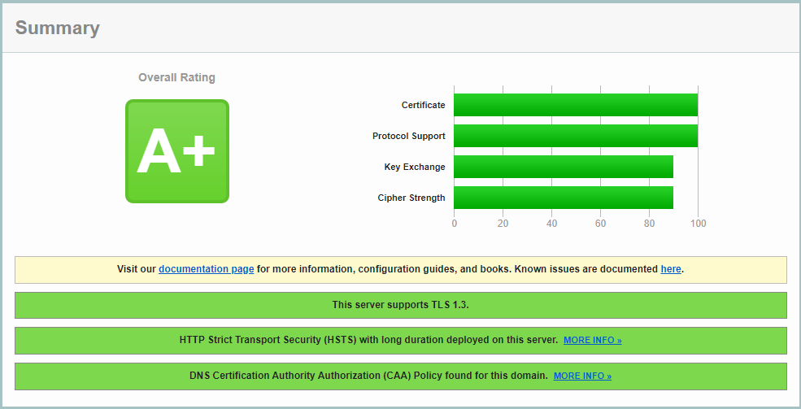
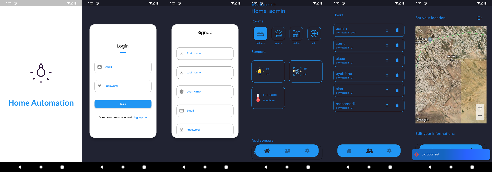

<h1 align="center">
   
  Home Automation using CoT
</h1>
<h3 align="center">
  Application of Cloud of Things on Home Automation
</h3>

  <h4>
    <a href="#Context">Context</a> |
    <a href="#Live-Demo">Live Demo</a> |
    <a href="#Installation-Guide">Installation Guide</a> |
    <a href="#Technologies">Technologies</a> |
    <a href="#Deployment-Server">Deployment Server</a> |
    <a href="#Certification-and-Grading">Certification and Grading</a> |
   <a href="#Screenshots">Screenshots</a> |
    <a href="#Further-Readings">Further Readings</a> |
    <a href="#Contribution">Contribution</a>
  </h4>

 

## Context
This project aims to prototype a home automation system with as many appliances and connected objects as possible. One other goal is to give homeowners total control over their homes to make interactions more effortless. The goals of this project are briefly: 
- Conception and realize a complete prototype of a home automation system with the ability to connect and control it remotely.
- Use different Inner and Outer network technologies: APIs, MQTT.
- Use devices that are easy to install
- Make it suitable for inexperienced users or even disabled users.
- Scalability: The network needs to be scalable, which means that the possibility to add new objects to the IoT network should be easy, and the integration of the new object in the control application needs to be straightforward.
## Live Demo
As for now, you can test the application by downloading the `.apk` file from the releases.
Also, you can test the application directly from your browser at https://homeautomationcot.me/ or https://api.homeautomationcot.me/. (note that some features are mobile-specific, and not all can be tested via the web version.)
## Installation Guide
We made sure that the architecture of the repository was well organized for users to test the project locally or build on it.
If you want to run the application locally, please follow the following steps: 
- Clone the repo: `git clone https://github.com/GhaziXX/Home-Automation-using-CoT.git`
- Install node RED on your Raspberry pi and then load the content of [flows.json](./iot/flows.JSON) into a new flow. Feel free to change the sensors and actuators pins, the MQTT broker, and the API link for getting a list of installed sensors.
- Move into the [api](./api/) directory and run `npm install` to install the required dependencies. (Please ensure that you have **node.js** installed in your machine).
- Open [env.config.js](./api/main/env.config.js) and set your settings (certificate path, MQTT broker settings, and you Mongodb link). 
- Run `npm start` to start the server locally.
- Move into the [frontend](./frontend/) directory - make sure that you have flutter installed on your machine - run `flutter pub get` Then select whether you want to run on your mobile, emulator, or web and run `flutter pub run`.
## Technologies
Multiple technologies, plugins, packages and hardware sensors and actuators were used while developing this project, the technologies are diverse and used for backend and frontend development.
- Backend:
  - Node.js: v16.13.1
  - Express: v4.17.1
  - Mongoose: v6.0.6
  - Passport: v0.4.1
  - Other usefull Node.js packages
- IoT:
  - Node RED
  - Communication protocols (I²C, SPI)
- Frontend
  - Flutter
  - Google Maps API
  - Dio (Network handeling)
  - Secure Storage (Secure jwt_token storage)
  - GetX (State Management)
  - Other usefull flutter packages
- Server
  - Mosquitto Broker
- Hardware
  - Raspberry Pi 4
  - Gas sensor MQ-2
  - Motion sensor PIR
  - CO sensor MQ135
  - Temperature & humidity sensor DHT11
  - Photo-resistor
## Deployment Server
We used two virtual machines from Google Cloud for running the project. (Basically, Google provides us with a 300$ to use them to try the different GCP products)
The first VM is dedicated to running the Node.js API server (Middleware). We also, have created a [deploy.sh](deploy.sh) file and a [cron job](cronjob.conf) that runs every day at midnight to check for changes and update the API. The second VM was set up as an MQTT broker using [Mosquitto](https://mosquitto.org/). We took that approach to increase the security and ensure that everything ran smoothly without an interception. But, it is not necessary to use two separate machines; you can use one VM as an MQTT broker and middlewareMiddleware.
The VMs are both e2-small machines (optimized for web hosting and serving (i.e., day to day usage)) and have the following characteristics:
- Ram: 2 Gib
- cores: 0.5
- vCPUs: 2
- Storage: 10 Gib
- Zone: us-central1-a
## Certification and Grading
HTTPS was ensured using Let's Encrypt's Certbot, providing secure communication with the middlewareMiddleware and the MQTT broker. DH (Diffie-Hellman parameters) parameters with 4096 bits are also used for TLS connections. In addition to that, some other security parameters were set on the Node.js server to ensure max security.
The grading of the server was tested using [SSLlabs](https://www.ssllabs.com/), and we had a grade of A+.

## Screenshots

## Further Readings
You can find more information and take a look at the architecture design with the following documents:
-  [User Guide](docs/User%20Guide.pdf)
-  [Design Document](docs/Design%20Document.pdf)
## Contribution
This project was developed as part of our Cloud of Things project at Sup'Com.

